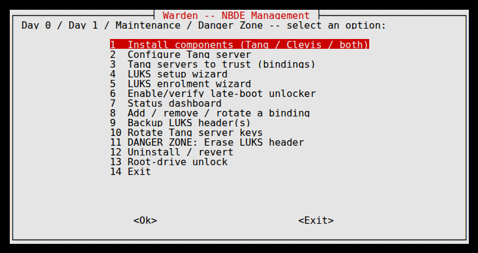
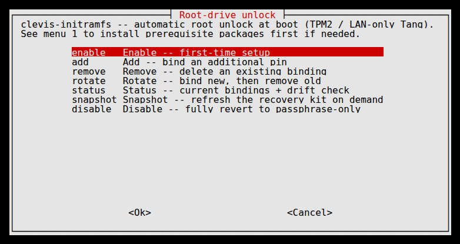

# Warden

Warden is a menu-driven TUI for managing Network-Bound Disk Encryption
(NBDE) on Ubuntu Server hosts: installing and configuring Tang and
Clevis, binding LUKS-encrypted drives (including the root filesystem
itself) to Tang servers or a TPM2 chip, and handling the ongoing
lifecycle — key rotation, header backups, uninstall, and secure
disposal.

## Philosophy

A few rules this project holds itself to, learned from real incidents
during development, not adopted as abstract best practice:

- **Safety first, always.** This tool edits disk encryption
  configuration and, in one deliberate path, can permanently destroy
  data. Every wizard supports a dry-run preview, every destructive
  action requires a typed confirmation bound to the specific device on
  screen (never a plain y/n), and nothing is ever assumed reversible
  unless it demonstrably is.
- **Check, don't assume.** Device names are re-resolved by UUID before
  every use, never trusted from a previous step. Package installs and
  systemd unit state are verified, not assumed to have succeeded.
  Reachability is tested, not inferred. Several real bugs in this
  project existed specifically because an assumption — about a path, a
  device state, a config default — went unchecked; see the wiki's
  Lessons Learned page for the actual incidents.
- **Prove it on real hardware, not just in a test suite.** The bats
  suite runs against loop-device-backed images and catches most
  regressions cheaply, but it cannot catch everything a real reboot
  can. Every menu in this project has been driven interactively
  against real Ubuntu Server hardware — real `tang`/`clevis`/
  `cryptsetup`/`systemd`, real reboots — specifically because a rootless
  dev sandbox and a real boot sequence do not always agree, and the
  gap between them is exactly where the interesting bugs live.
- **Stay auditable.** Bash and whiptail, not a larger framework: every
  action needs to stay readable and traceable line-by-line rather than
  hidden behind abstraction, and every mutating command routes through
  one logging chokepoint so a session can always be reconstructed
  after the fact.

## Features

- **Install & configure** — Tang, Clevis, TPM2 support, ZFS, and
  Tailscale, each offered as an independent, optional component; never
  installed unless asked for.
- **Enrol & unlock secondary drives** — format a new LUKS device or
  enrol an existing one, bind it to a Tang server (including over
  Tailscale), a TPM2 chip, or a Shamir's Secret Sharing threshold
  across multiple servers.
- **Root-drive unlock** — the same automatic unlock for the machine's
  *own* root filesystem, not just secondary drives, via TPM2 and/or a
  LAN-only Tang server — with its own machine-specific recovery kit
  (a guide and a self-contained restore script) generated before any
  change is made, and never removing the original passphrase.
- **ZFS pool support** — a LUKS-encrypted device can hold a single-disk
  ZFS pool instead of a plain filesystem, auto-imported and mounted on
  unlock with no `/etc/fstab` entry needed.
- **Ongoing lifecycle** — a live status dashboard, add/remove/rotate a
  binding, LUKS header backup, Tang server key rotation, uninstall, and
  a structurally separate Danger Zone for cryptographic erase — kept
  entirely unreachable from the normal wizards by design.

Every one of the above has been driven interactively against real
Ubuntu Server hardware with real reboots, not just exercised through
the automated test suite — see the wiki's Lessons Learned page for
what that testing actually found and fixed along the way.

## Screenshots

<!-- markdownlint-disable MD033 -->
<p align="center">
  
</p>
<p align="center">
  
</p>
<!-- markdownlint-enable MD033 -->

## Scope

Ubuntu Server hosts only. A Tang server running elsewhere (e.g. as a
Docker container on a separate NAS) is managed through that platform's
own tooling and is out of scope — where an Ubuntu host runs Tang
itself as a native systemd service, that *is* in scope.

## Prerequisites

- Ubuntu Server 24.04 LTS
- `whiptail` (present by default on Ubuntu Server)
- Root privileges to run `bin/warden` (see Safety model)

For development/testing: `shellcheck`, [`bats`](https://github.com/bats-core/bats-core).

## Quick start

```sh
sudo bin/warden
```

## Architecture

Bash + whiptail, not a larger framework: given that this tool edits
disk encryption configuration and, in one path, can permanently destroy
data, every action needs to stay readable and auditable line-by-line
rather than hidden behind abstraction.

```
bin/warden          entrypoint: root check, sourcing, main menu loop
lib/core/           safety primitives — see "Safety model" below
lib/tui/            whiptail wrappers
lib/features/       one file per menu item
tests/bats/         test suite, run against loop-device-backed images
docs/               usage docs per menu path
```

Every mutating command in every feature routes through
`lib/core/exec.sh`'s `run_cmd`, which is the single chokepoint that
makes dry-run and logging structural guarantees rather than something
each wizard has to remember to implement.

## Safety model

These requirements are non-negotiable, and several of them exist
because of real incidents, not hypothetical caution:

- **State is checked before every action.** Running Warden twice, or
  interrupting it (Ctrl-C, power loss, reboot) and running it again,
  must never leave the system inconsistent or redo completed work.
- **Devices are resolved by UUID, never by `/dev/sdX` name**, which is
  not stable across reboots. Device letters may appear in menus for
  readability but are always re-resolved before use.
- **The root/boot/EFI guard.** Before any destructive disk operation,
  Warden shows the current `lsblk -f` view, refuses by default if the
  target is or backs the current root filesystem, `/boot`, or
  `/boot/efi`, and requires a distinct typed-confirmation override to
  proceed. This exists because of a near-miss where an EFI boot
  partition was almost run through `cryptsetup luksFormat` by mistake —
  the operator was confident, just wrong about the target, so a plain
  y/n confirmation would not have caught it.
- **Destructive confirmations are typed, never y/n**, and are bound to
  the specific device on screen (e.g. a UUID fragment), not a
  memorizable fixed phrase — so the confirmation can't be given on
  autopilot for the wrong device.
- **Backup before editing.** `/etc/crypttab` and `/etc/fstab` are never
  edited in place without a timestamped backup first, and edits are
  minimal/targeted appends rather than wholesale regeneration, so
  unrelated existing entries are never touched or reordered.
- **Dry-run mode for every wizard**, showing exactly what would run
  and change before anything is committed.
- **Every action is logged** to a timestamped session log: commands
  run, files changed, before/after diffs. Recovery passphrases
  themselves are the one deliberate exception — Warden logs that a
  passphrase was set, never the passphrase value.
- **Idempotent installs.** Package installs, systemd unit enablement,
  and crypttab/fstab entries are all checked before being added. This
  exists because of a confirmed incident where `clevis-systemd` was
  missed on install, silently breaking late-boot unlock — every
  required package is checked explicitly and individually, never
  assumed to ride in with a related one.
- **Root-drive unlock can never be reached by accident.** Menu 13 is
  structurally separate from the general enrolment/binding menus —
  the same isolation the Danger Zone already has from Uninstall — and
  always keeps the original LUKS passphrase working, with a
  machine-specific recovery kit generated before any change is made.

See the wiki's "Lessons learned" page for the full background on each
real incident referenced above.

## Testing

The test suite runs against loop-device-backed sparse image files
(`truncate` + `losetup` + real `cryptsetup`/LUKS), never real hardware:

```sh
bats tests/bats/
```

Some tests require root (anything that actually formats a loop device
or reloads systemd units) and are skipped otherwise. CI only runs
`shellcheck` — the available runner is a shared, non-ephemeral host,
not a safe place to install packages or run the bats suite (real loop
devices, real `cryptsetup`) against. Run `bats tests/bats/` as root
locally, or on a dedicated disposable test VM, to exercise the
root-gated tests for real.

## Documentation

Menu-path usage docs live in `docs/usage/`. The
[wiki](https://github.com/warden-project/warden/wiki) covers how NBDE
works in this setup, troubleshooting/FAQ, and lessons learned.
Documentation is part of the definition of done for any change, not a
follow-up. The original design spec this project was built from is
kept at `docs/original-spec.md` for reference. Ideas raised but not
yet scoped or scheduled (e.g. multi-drive ZFS mirrors/raidz) are
tracked in `docs/future-work.md` so they don't get lost.

## License

Licensed under the GNU Affero General Public License v3.0 or later —
see [`LICENSE`](LICENSE).
